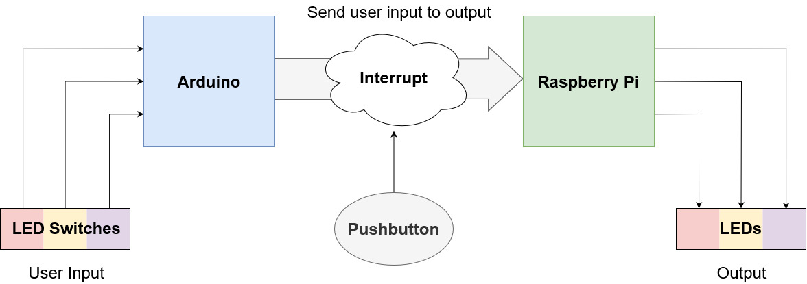
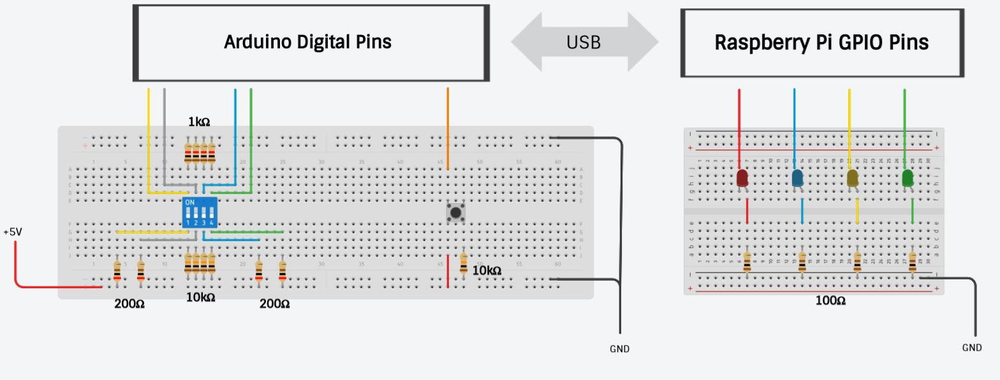

# Arduino-Raspi-Serial-Communication

Using serial communication to send data from an Arduino to a Raspberry Pi. The application in this project uses the Arduino
as a transmitting device that reads a switch configuration set by the user. The configuration is interpreted as a binary
number, and is sent to the Raspberry Pi where it lights the LEDs according to the switch configuration.

# Hardware

## Components

> Note: Up to 8 LEDs can be supported, but for this example, 4 LEDs are used

**Transmitter (Arduino)**
- 1x Arduino Uno (or equivalent)
- 1x Pushbutton
- 5x 10kΩ Resistors
- 4x 1kΩ Resistors
- 4x 200Ω Resistors

**Receiver (Raspberry Pi)**
- 1x Raspberry Pi
- 4x LEDs
- 4x 100Ω Resistors

# Python Dependencies
- [gpiozero](https://gpiozero.readthedocs.io/en/stable/)
- [pyserial](https://pyserial.readthedocs.io/en/latest/)

# References
1. [[The Robotics Back-End](https://roboticsbackend.com/raspberry-pi-arduino-serial-communication/)] Introduces the `pyserial` API and how to use it to communication with other devices like the Arduino.

2. [[Raspberry Pi Physical Computing Tutorial](https://projects.raspberrypi.org/en/projects/physical-computing)] Demonstrates how to use the `gpiozero` API to use the GPIO pins on the raspberry pi to control LEDs.

3. [[Raspberry Pi GPIO Pinout](https://pinout.xyz/#)] Documentation for the GPIO pins on the raspberry pi.
